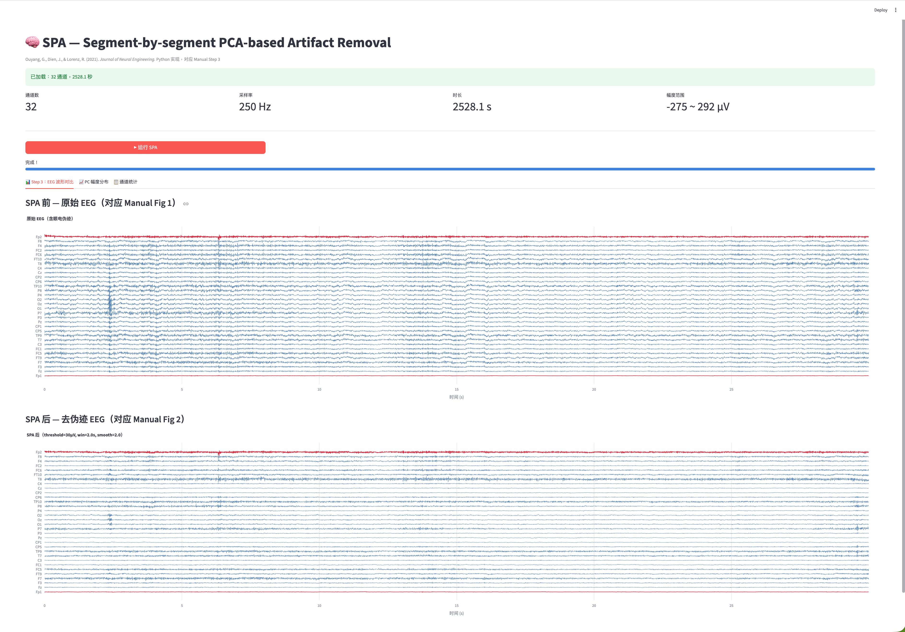
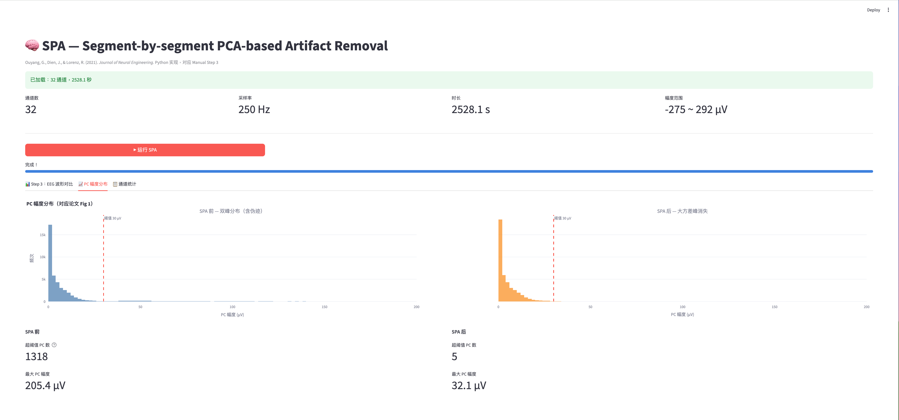
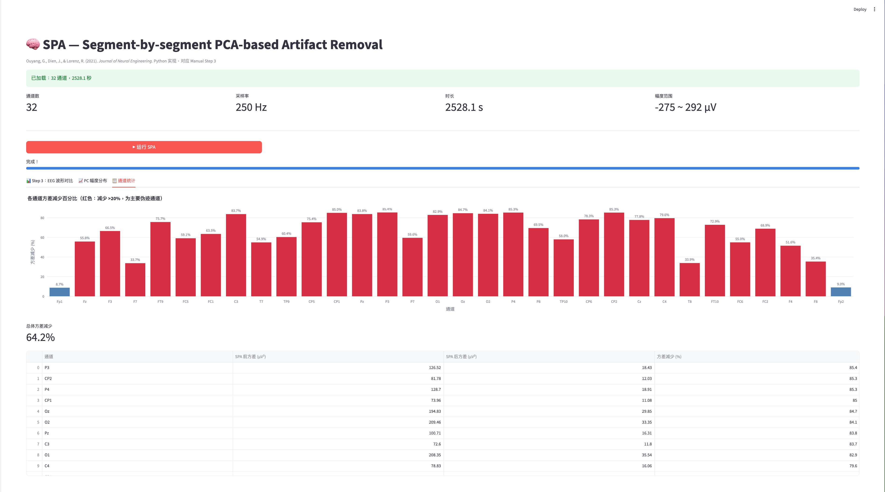
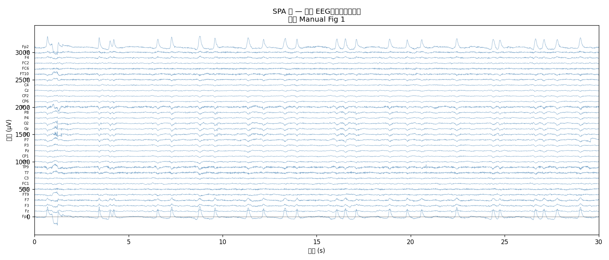
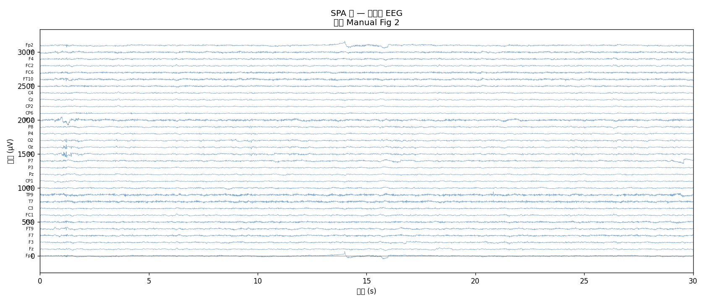
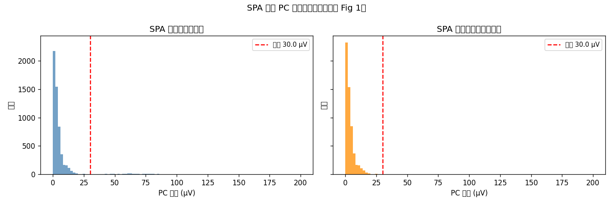

# SPA-Python

A Python implementation of **SPA (Segment-by-segment PCA-based Artifact Removal)** for EEG data, with an interactive Streamlit UI that mirrors the workflow described in the original MATLAB manual.

> **Reference:** Ouyang, G., Dien, J., & Lorenz, R. (2021). Handling EEG artifacts and searching individually optimal experimental parameter in real time: a system development and demonstration. *Journal of Neural Engineering.*  [Original MATLAB toolbox](https://github.com/guangouyang/SPA)

---

## What is SPA?

SPA removes large-variance EEG artifacts (eye blinks, muscle activity) using a simple yet effective approach:

1. Split continuous EEG into short segments (default: 2 s)
2. Apply PCA to each segment
3. **Zero out any PC whose amplitude exceeds a threshold** (default: 30 µV)
4. Reconstruct the signal from the remaining PCs
5. Smooth the boundaries between adjacent segments

The key insight is that artifact PCs form a **bimodal distribution** — they cluster at much higher variances than neural PCs, making a simple amplitude threshold sufficient.

| Method | Time per trial | Deviation from ICA |
|--------|---------------|--------------------|
| ICA (offline) | 436 ms | benchmark |
| ASR (online) | 6.4 ms | up to 20% |
| **SPA (this)** | **0.8 ms** | **< 6% (most effects)** |

---

## Demo

### Tab 1 — EEG Waveform Comparison (Manual Step 3: Fig 1 → Fig 2)

Before SPA (top) and after SPA (bottom). Ocular artifact channels Fp1/Fp2 are highlighted in red — large eye-blink spikes are clearly visible before and removed after.



### Tab 2 — PC Amplitude Distribution (Paper Fig 1)

Left: bimodal distribution before SPA (1318 PCs above threshold, max 205.4 µV). Right: upper mode eliminated after SPA (only 5 PCs remain above threshold, max 32.1 µV). The red dashed line marks the 30 µV threshold.



### Tab 3 — Channel Statistics

Per-channel variance reduction. Channels with >20% reduction are shown in red. Total variance reduced by **64.2%** in this example. The sortable table lists exact before/after variances for every channel.



---

## Results on Sample Data

Running on the included 32-channel, 150 Hz oddball dataset (~353 s):

| Metric | Value |
|--------|-------|
| Total variance removed | **83.9%** |
| Fp1 (ocular channel) | reduced by **97.5%** |
| Fp2 (ocular channel) | reduced by **97.3%** |
| RMS before SPA | 12.88 µV |
| RMS after SPA | 5.17 µV |

**Before SPA** (Manual Fig 1 equivalent) — eye-blink artifacts clearly visible in Fp1/Fp2:



**After SPA** (Manual Fig 2 equivalent) — ocular artifacts removed:



**PC amplitude distribution** — bimodal before, upper peak removed after SPA:



---

## Sample Data

The validation script and UI default to the **sample dataset** from the original SPA toolbox:

- **Source:** [guangouyang/SPA](https://github.com/guangouyang/SPA) → `SPA1.0/sample_data/`
- **Files:** `sample_data.set` + `sample_data.fdt` (EEGLAB format)
- **Content:** Single participant, visual oddball task (`S 22` frequent / `S 21` oddball)
- **Specs:** 32 channels · 150 Hz · ~353 s · 1–40 Hz bandpass · average reference

Download and place the files at:
```
spa-python/
└── sample_data/
    ├── sample_data.set
    └── sample_data.fdt
```

Then update the path in `validate.py` and `app.py` (`SAMPLE_SET` constant) to point to your local copy, or simply upload the files through the Streamlit sidebar.

---

## Project Structure

```
spa-python/
├── spa/
│   ├── __init__.py
│   └── core.py          # SPA algorithm: spa_segment, smooth_fusing_epochs, spa_eeg
├── app.py               # Streamlit interactive UI
├── validate.py          # Headless validation script (saves output PNGs)
├── requirements.txt
└── .gitignore
```

---

## Quick Start

### 1. Clone and set up environment

```bash
git clone https://github.com/PandaQQ/SPA-Python.git
cd spa-python

# Create Python 3.12 virtual environment
python3.12 -m venv .venv
source .venv/bin/activate      # macOS / Linux
# .venv\Scripts\activate       # Windows

pip install -r requirements.txt
```

### 2. Run the Streamlit UI

```bash
streamlit run app.py
```

Open [http://localhost:8501](http://localhost:8501) in your browser.

- Click **"Use sample data"** in the sidebar
- Adjust parameters if desired (or keep defaults: threshold=30, win=2s, smooth=2)
- Click **"▶ Run SPA"**
- Explore the three tabs

### 3. Run the validation script

```bash
python validate.py
```

Prints statistics and saves `outputs/raw_eeg.png`, `outputs/spa_eeg.png`, and `outputs/pca_dist.png`.

---

## Streamlit UI

The UI is organized into three tabs, directly corresponding to the SPA manual:

| Tab | Content | Manual reference |
|-----|---------|-----------------|
| **Step 3: EEG Waveforms** | Before/after waveform comparison, all 32 channels stacked, ocular channels highlighted | Manual Fig 1 → Fig 2 |
| **PC Amplitude Distribution** | Histogram of all PC amplitudes across segments; threshold line; bimodal → unimodal | Paper Fig 1 |
| **Channel Statistics** | Per-channel variance reduction bar chart; summary table | — |

**Sidebar parameters:**

| Parameter | Default | Description |
|-----------|---------|-------------|
| `threshold` | 30 µV | PC amplitude above which a component is treated as artifact |
| `window_size` | 2 s | Duration of each EEG segment |
| `smoothing` | 2 | Transition sharpness between adjacent segments (must be > 1) |

---

## Python API

Use SPA directly in your own pipeline:

```python
import mne
from spa.core import spa_eeg

# Load EEG data with MNE (units: Volts)
raw = mne.io.read_raw_eeglab("your_data.set", preload=True)
data = raw.get_data()          # shape: (n_channels, n_times)
srate = raw.info["sfreq"]

# Run SPA — threshold is in Volts (30 µV = 30e-6)
data_clean = spa_eeg(
    data,
    srate,
    threshold=30e-6,   # 30 µV
    win_size=2.0,      # seconds
    smooth_para=2.0,
)

# Write back to MNE Raw object
raw._data[:] = data_clean
```

### Core functions (`spa/core.py`)

```python
spa_eeg(data, srate, threshold=30e-6, win_size=2.0, smooth_para=2.0, progress_callback=None)
# Main function — processes continuous EEG, returns cleaned array

spa_segment(segment, threshold)
# Applies PCA to a single (n_channels, n_times) segment and removes artifact PCs

smooth_fusing_epochs(sig1, sig2, smooth_para)
# Smooths the boundary between two adjacent signal segments

compute_pc_amplitudes(data, srate, win_size=2.0)
# Returns all PC amplitudes across segments (for distribution visualization)
```

---

## Algorithm Details

The Python implementation is a direct port of the MATLAB source. The equivalence between MATLAB and Python:

| MATLAB | Python (`spa/core.py`) |
|--------|----------------------|
| `[a, b, c] = pca(temp')` | `U, S, Vt = np.linalg.svd(Xc, full_matrices=False)` |
| `b(:, c > threshold^2) = 0` | `scores[:, latent > threshold**2] = 0` |
| `temp = (b * a')'` | `cleaned = (scores @ Vt + mu).T` |
| `smooth_fusing_epochs(sig1, sig2, p)` | `smooth_fusing_epochs(sig1, sig2, smooth_para)` |

> **Unit note:** MNE loads EEG in **Volts**. Pass `threshold=30e-6` (30 µV) when working with MNE data. The original MATLAB toolbox works in µV and uses `threshold=30`.

---

## Requirements

- Python 3.12+
- `mne >= 1.6`
- `numpy >= 1.24`
- `scipy >= 1.10`
- `plotly >= 5.14`
- `streamlit >= 1.28`

---

## When to Use SPA

**SPA is designed for:**
- Online / real-time artifact removal where computation speed matters
- Neuroadaptive paradigms requiring fast ERP extraction
- Quick offline preprocessing as a first-pass cleaner

**SPA is NOT a replacement for:**
- Offline ICA-based artifact removal for publication-quality preprocessing
- Methods that identify specific artifact types (heartbeat, muscle, line noise)

---

## License

This Python implementation follows the license of the original SPA MATLAB toolbox. See [guangouyang/SPA](https://github.com/guangouyang/SPA) for the original source and license.